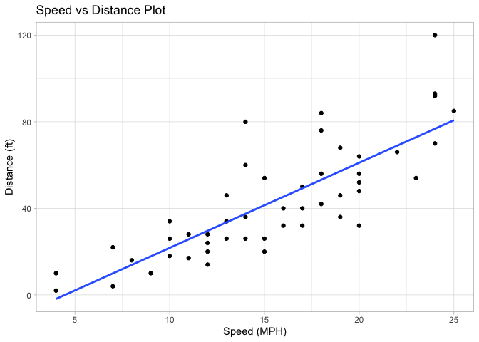
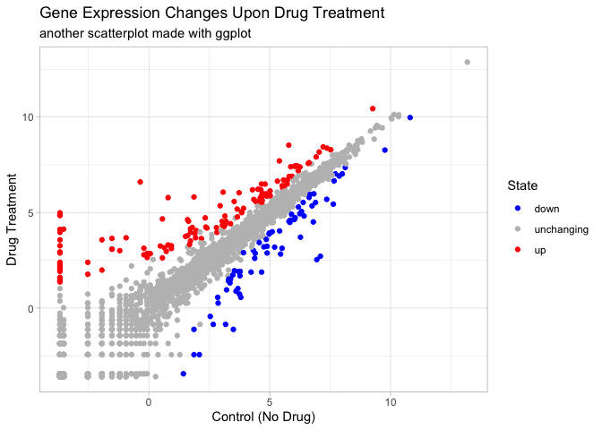
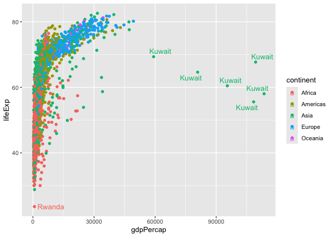

# Class 05: Data Visualization with GGPLOT
Alisa Zhang (PID: A18299618)

Today we are exploring the **ggplot** package and how to make nice
figures in R.

There are lots of ways to make figures and plots in R. These include:

- so called “base” R
- and add on packages like **ggplot2**

Here is a simple “base” R plot.

``` r
head(cars)
```

      speed dist
    1     4    2
    2     4   10
    3     7    4
    4     7   22
    5     8   16
    6     9   10

We can simply pass this to the `plot()` functions.

``` r
plot(cars)
```


> Key-point: Base R is quick but simple looking.

Let’s see how we can plot this with the **ggplot2**…

First, we need to install this add-on package. For this we can use the
`install.packages()` function - WE DO THIS IN THE CONSOLE, NOT our
report.

Second, we need to load the package with the `library()` function
everytime we want to use it.

``` r
library(ggplot2)
ggplot(cars)
```


Every ggplot is composed of at least 3 layers:

- **data** (i.e. a data.frame with teh things you want to plot),
- aesthetics **aes()** that map the columns of data to your plot
  features
- geoms like **geom_point()** that shows how the plot appears

``` r
ggplot(cars) +
  aes(x = speed, y = dist) +
  geom_point()
```


> For simple “canned” graphs base R is quicker, but as things get more
> custom and elobrate then ggplot wins out.

Lets add more layers to out ggplot

Add a line showing the relationship between x and y Add a title Add
custom axis labels “Speed (MPH)” and “Distance (ft)” Change the theme…

``` r
ggplot(cars) +
  aes(x = speed, y = dist) +
  geom_point() +
  geom_smooth(method = "lm", se = F) +
  labs(
    title = "Speed vs Distance Plot",
    x = "Speed (MPH)",
    y = "Distance (ft)"
  ) +
  theme_light()
```

    `geom_smooth()` using formula = 'y ~ x'



## Going further - Gene Expression Dataset

Read some gene expression data

``` r
url <- "https://bioboot.github.io/bimm143_S20/class-material/up_down_expression.txt"
genes <- read.delim(url)
head(genes)
```

            Gene Condition1 Condition2      State
    1      A4GNT -3.6808610 -3.4401355 unchanging
    2       AAAS  4.5479580  4.3864126 unchanging
    3      AASDH  3.7190695  3.4787276 unchanging
    4       AATF  5.0784720  5.0151916 unchanging
    5       AATK  0.4711421  0.5598642 unchanging
    6 AB015752.4 -3.6808610 -3.5921390 unchanging

> Q1. How many genes are in this dataset

``` r
nrow(genes)
```

    [1] 5196

``` r
ncol(genes)
```

    [1] 4

``` r
colnames(genes)
```

    [1] "Gene"       "Condition1" "Condition2" "State"     

> Q2. How many upregulated genes are there

A useful function for counting up occurancee of things in a vector is
the `table()` function.

``` r
table(genes$State)
```


          down unchanging         up 
            72       4997        127 

Make a v1 figure

``` r
p <- ggplot(genes) +
  aes(
    x = Condition1,
    y = Condition2,
    colour = State
  ) +
  geom_point()
```

``` r
p + 
  scale_color_manual(values = c("blue", "grey", "red")) +
  labs(
    title = "Gene Expression Changes Upon Drug Treatment",
    subtitle = "another scatterplot made with ggplot",
    x = "Control (No Drug)",
    y = "Drug Treatment"
  ) +
  theme_light()
```



## More Plotting Examples - `gapminder` Dataset

``` r
# File location online
url <- "https://raw.githubusercontent.com/jennybc/gapminder/master/inst/extdata/gapminder.tsv"

gapminder <- read.delim(url)
```

``` r
head(gapminder, 3)
```

          country continent year lifeExp      pop gdpPercap
    1 Afghanistan      Asia 1952  28.801  8425333  779.4453
    2 Afghanistan      Asia 1957  30.332  9240934  820.8530
    3 Afghanistan      Asia 1962  31.997 10267083  853.1007

``` r
tail(gapminder, 3)
```

          country continent year lifeExp      pop gdpPercap
    1702 Zimbabwe    Africa 1997  46.809 11404948  792.4500
    1703 Zimbabwe    Africa 2002  39.989 11926563  672.0386
    1704 Zimbabwe    Africa 2007  43.487 12311143  469.7093

> Q4. How many different countries are in this dataset

``` r
length(table(gapminder$country))
```

    [1] 142

> Q5. Number of continents

``` r
unique(gapminder$continent)
```

    [1] "Asia"     "Europe"   "Africa"   "Americas" "Oceania" 

Version 1 plot

``` r
ggplot(gapminder) +
  aes(gdpPercap, lifeExp, colour = continent) +
  geom_point()
```


``` r
ggplot(gapminder) +
  aes(gdpPercap, lifeExp, colour = continent, label = country) +
  geom_point() +
  geom_text()
```


I can use the `ggrepel` package to make more sensible labels here

``` r
library(ggrepel)

ggplot(gapminder) +
  aes(gdpPercap, lifeExp, colour = continent, label = country) +
  geom_point() +
  geom_text_repel()
```

    Warning: ggrepel: 1697 unlabeled data points (too many overlaps). Consider
    increasing max.overlaps



I want a separate pannel per continent

``` r
ggplot(gapminder) +
  aes(gdpPercap, lifeExp, colour = continent, label = country) +
  geom_point() +
  facet_wrap(~continent)
```


Let’s focus on the main advantages of ggplot over base R:

1.  **Layered Grammar of Graphics**: ggplot uses a consistent, layered
    approach. You build plots by adding layers (data, aesthetics, geoms,
    themes) with the `+` operator. This makes complex plots easier to
    construct and modify, compared to base R where each plot type often
    requires a different function and many arguments
    [\[1\]](https://drive.google.com/file/d/1BYSWJLROqxA1YpuDhJkzUolhiZqiOOKg/view?usp=drivesdk),
    [\[3\]](https://drive.google.com/file/d/1tFqKg9_nhVMmKYfiM1CQKDS2PmPwLh8n/view?usp=drivesdk),
    [\[2\]](https://drive.google.com/file/d/1Clw2_EJ_hY3USNwObiPnxpIQIfirxfW0/view?usp=drivesdk),
    [\[4\]](https://drive.google.com/file/d/1FDBbIi2Rlw2In9mClB7Mub8oUPgx6y8h/view?usp=drivesdk),
    [\[5\]](https://drive.google.com/file/d/15xXaaIcCWOc_x1gJLdySWOd_sfMXTiaw/view?usp=drivesdk).

2.  **Publication-Quality Defaults**: ggplot produces attractive,
    publication-ready figures by default. Base R plots are quick but
    often require a lot of manual tweaking to look polished
    [\[1\]](https://drive.google.com/file/d/1BYSWJLROqxA1YpuDhJkzUolhiZqiOOKg/view?usp=drivesdk),
    [\[3\]](https://drive.google.com/file/d/1tFqKg9_nhVMmKYfiM1CQKDS2PmPwLh8n/view?usp=drivesdk),
    [\[2\]](https://drive.google.com/file/d/1Clw2_EJ_hY3USNwObiPnxpIQIfirxfW0/view?usp=drivesdk),
    [\[4\]](https://drive.google.com/file/d/1FDBbIi2Rlw2In9mClB7Mub8oUPgx6y8h/view?usp=drivesdk),
    [\[5\]](https://drive.google.com/file/d/15xXaaIcCWOc_x1gJLdySWOd_sfMXTiaw/view?usp=drivesdk).

3.  **Declarative Syntax**: In ggplot, you declare what you want to show
    (e.g., which variables map to which aesthetics), rather than
    specifying every detail step-by-step as in base R
    [\[1\]](https://drive.google.com/file/d/1BYSWJLROqxA1YpuDhJkzUolhiZqiOOKg/view?usp=drivesdk),
    [\[3\]](https://drive.google.com/file/d/1tFqKg9_nhVMmKYfiM1CQKDS2PmPwLh8n/view?usp=drivesdk),
    [\[2\]](https://drive.google.com/file/d/1Clw2_EJ_hY3USNwObiPnxpIQIfirxfW0/view?usp=drivesdk),
    [\[4\]](https://drive.google.com/file/d/1FDBbIi2Rlw2In9mClB7Mub8oUPgx6y8h/view?usp=drivesdk),
    [\[5\]](https://drive.google.com/file/d/15xXaaIcCWOc_x1gJLdySWOd_sfMXTiaw/view?usp=drivesdk).

4.  **Consistency and Reproducibility**: ggplot’s approach is consistent
    across plot types, making it easier to learn and reproduce complex
    visualizations. Base R can be more idiosyncratic, with different
    functions and arguments for each plot type
    [\[1\]](https://drive.google.com/file/d/1BYSWJLROqxA1YpuDhJkzUolhiZqiOOKg/view?usp=drivesdk),
    [\[3\]](https://drive.google.com/file/d/1tFqKg9_nhVMmKYfiM1CQKDS2PmPwLh8n/view?usp=drivesdk),
    [\[2\]](https://drive.google.com/file/d/1Clw2_EJ_hY3USNwObiPnxpIQIfirxfW0/view?usp=drivesdk),
    [\[4\]](https://drive.google.com/file/d/1FDBbIi2Rlw2In9mClB7Mub8oUPgx6y8h/view?usp=drivesdk),
    [\[5\]](https://drive.google.com/file/d/15xXaaIcCWOc_x1gJLdySWOd_sfMXTiaw/view?usp=drivesdk).

5.  **Customization and Extensibility**: ggplot makes it easy to add
    layers (like trend lines, color scales, themes) and customize every
    aspect of the plot. Base R allows pixel-level control but is more
    cumbersome for complex customizations
    [\[1\]](https://drive.google.com/file/d/1BYSWJLROqxA1YpuDhJkzUolhiZqiOOKg/view?usp=drivesdk),
    [\[3\]](https://drive.google.com/file/d/1tFqKg9_nhVMmKYfiM1CQKDS2PmPwLh8n/view?usp=drivesdk),
    [\[2\]](https://drive.google.com/file/d/1Clw2_EJ_hY3USNwObiPnxpIQIfirxfW0/view?usp=drivesdk),
    [\[4\]](https://drive.google.com/file/d/1FDBbIi2Rlw2In9mClB7Mub8oUPgx6y8h/view?usp=drivesdk),
    [\[5\]](https://drive.google.com/file/d/15xXaaIcCWOc_x1gJLdySWOd_sfMXTiaw/view?usp=drivesdk).
