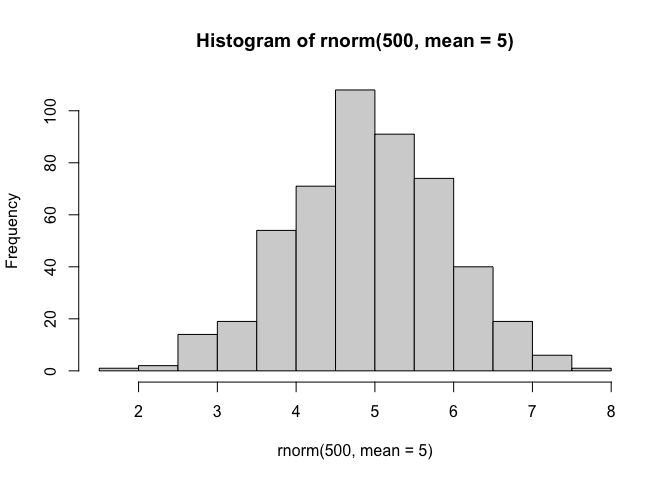
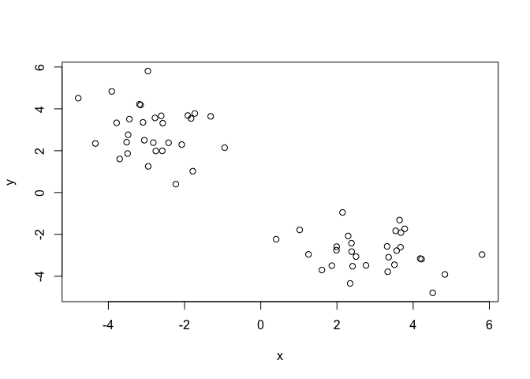
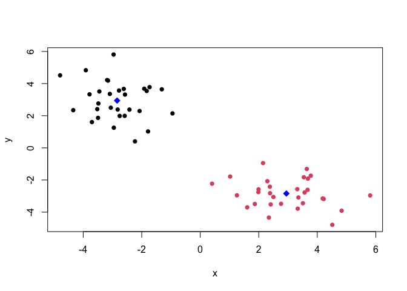
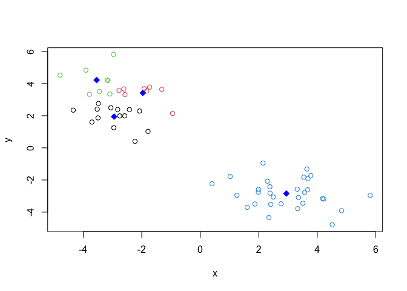
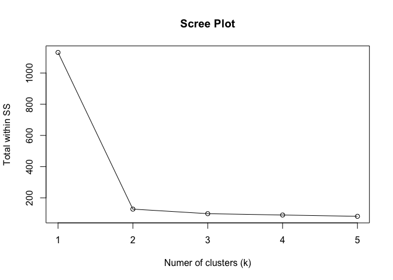
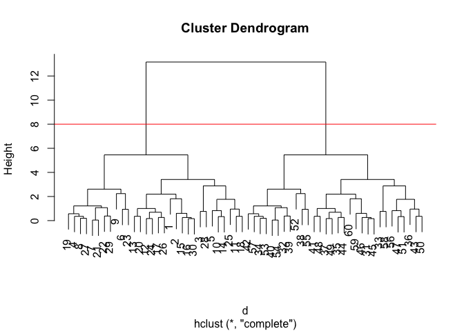
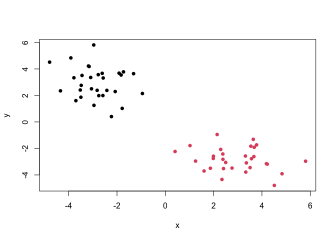
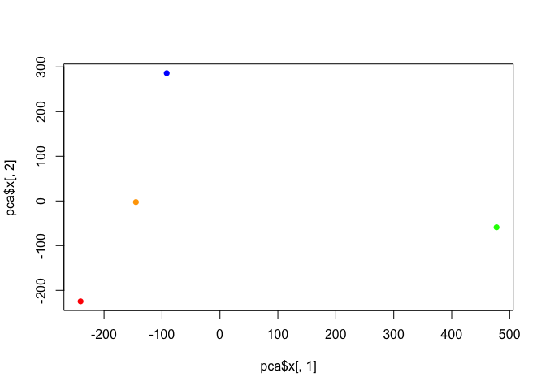
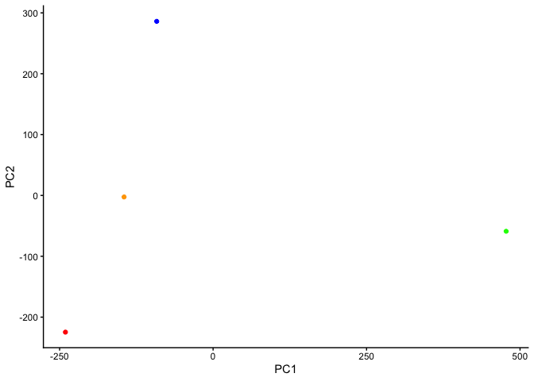

# Class 7: Introduction to Machine Learning Lab
Alisa Zhang (PID: A18299618)

Today we will explore some fundamental machine learning methods
including clustering and dimensionality reduction.

## K-means clustering

To see how this works, let’s first makeup some data to cluster where we
know what the answer should be. We can use the `rnorm()` fuction to help
here:

``` r
hist(rnorm(500, mean=5))
```



``` r
x <- c(rnorm(30, mean=-3), rnorm(30, mean=3))
y <- rev(x)
```

``` r
x <- cbind(x, y)
plot(x)
```



The function for K-means clustering in “base” R is `kmeans()`

``` r
km <- kmeans(x, centers = 2)
km
```

    K-means clustering with 2 clusters of sizes 30, 30

    Cluster means:
              x         y
    1 -2.841448  2.943344
    2  2.943344 -2.841448

    Clustering vector:
     [1] 1 1 1 1 1 1 1 1 1 1 1 1 1 1 1 1 1 1 1 1 1 1 1 1 1 1 1 1 1 1 2 2 2 2 2 2 2 2
    [39] 2 2 2 2 2 2 2 2 2 2 2 2 2 2 2 2 2 2 2 2 2 2

    Within cluster sum of squares by cluster:
    [1] 63.85369 63.85369
     (between_SS / total_SS =  88.7 %)

    Available components:

    [1] "cluster"      "centers"      "totss"        "withinss"     "tot.withinss"
    [6] "betweenss"    "size"         "iter"         "ifault"      

To get the results of the returend list object, we can use the dollor
`$` syntax

> Q1. How many points are in each cluster?

``` r
km$size
```

    [1] 30 30

> Q2. What ‘component’ of your result object details - cluster
> assignment/membership? - cluster center?

``` r
km$cluster
```

     [1] 1 1 1 1 1 1 1 1 1 1 1 1 1 1 1 1 1 1 1 1 1 1 1 1 1 1 1 1 1 1 2 2 2 2 2 2 2 2
    [39] 2 2 2 2 2 2 2 2 2 2 2 2 2 2 2 2 2 2 2 2 2 2

``` r
km$centers
```

              x         y
    1 -2.841448  2.943344
    2  2.943344 -2.841448

> Q3. Make a clustering result figure of the data colored by cluster
> membership.

``` r
plot(x, col=km$cluster, pch=16)
# if col=c("red", "blue), the vector would recycle to length of 60 alternating colors

points(km$centers, col="blue", pch=18, cex=1.5)
```



K-means clustering is very popular as it is very fast and relatively
straightforward: it takes numeric data as input and returns the cluster
membership vector etc.

The *“issue”* is that we tell `kmeans()` how many clusters we want.

> Q4. Run kmeans again and cluster into 4 groups and plot the results
> like we did above.

``` r
km2 <- kmeans(x, centers=4)
plot(x, col=km2$cluster)
points(km2$centers, col="blue", pch=18, cex=1.5)
```



``` r
# Within Sum of Square
mean(km$withinss)
```

    [1] 63.85369

*Scree plot*

``` r
ssvec <- c()

for(i in 1:5){
  km <- kmeans(x, centers = i)
  ssvec[i] <- km$tot.withinss
}
plot(c(1:5), ssvec, type="o", xlab="Numer of clusters (k)", ylab="Total within SS", main="Scree Plot")
```



## Hierarchical Clustering

The main base R function for Hierarchical Clustering is called
`hclust()`. Here we can’t just input our data, we need to first
calculate a distance matrix (e.g. `dist()`) for out data and use this as
input to `hclust()`.

``` r
d <- dist(x)
hc <- hclust(d)
hc
```


    Call:
    hclust(d = d)

    Cluster method   : complete 
    Distance         : euclidean 
    Number of objects: 60 

There is a plot method for class `hclust` results. Lets try

``` r
plot(hc)
abline(h=8, col='red')
```



To get our cluster membership vector (i.e. out main cluster result), we
can *cut the tree* at a given height or at a height that yields a given
“k”.

``` r
cutree(hc, h=8)
```

     [1] 1 1 1 1 1 1 1 1 1 1 1 1 1 1 1 1 1 1 1 1 1 1 1 1 1 1 1 1 1 1 2 2 2 2 2 2 2 2
    [39] 2 2 2 2 2 2 2 2 2 2 2 2 2 2 2 2 2 2 2 2 2 2

``` r
grps <- cutree(hc, k=2)
```

> Q. Plot the data with our hclust result coloring

``` r
plot(x, col = grps, pch = 16)
```



# Principal Component Analysis (PCA)

## PCA of UK food data

Import food data from an online CSV file:

``` r
url <- "https://tinyurl.com/UK-foods"
x <- read.csv(url, row.names = 1)
head(x)
```

                   England Wales Scotland N.Ireland
    Cheese             105   103      103        66
    Carcass_meat       245   227      242       267
    Other_meat         685   803      750       586
    Fish               147   160      122        93
    Fats_and_oils      193   235      184       209
    Sugars             156   175      147       139

Some base figures

``` r
barplot(as.matrix(x), beside=T, col=rainbow(nrow(x)))
```


``` r
# Stacked bar chart - NOT useful
barplot(as.matrix(x), beside=F, col=rainbow(nrow(x)))
```


There is one plot that can be useful for small datasets:

``` r
pairs(x, col=rainbow(nrow(x)), pch=16)
```


> Main point: It can be difficult to spot major trends and patterns even
> in relatively small multivariate datasets (here we only have 17
> dimensions. Typically we have 1000s).

## PCA to the rescue

The main function in “base” R for PCA is called `prcomp()`.

I will take the transpose of our data so the “foods” are in columns.

``` r
pca <- prcomp( t(x) ) 
summary(pca)
```

    Importance of components:
                                PC1      PC2      PC3       PC4
    Standard deviation     324.1502 212.7478 73.87622 2.921e-14
    Proportion of Variance   0.6744   0.2905  0.03503 0.000e+00
    Cumulative Proportion    0.6744   0.9650  1.00000 1.000e+00

``` r
# See how PC1 and PC2 captured 96% of the variance -> good enough representative of the data
```

``` r
cols <- c("orange","red","blue","green")
plot(pca$x[,1], pca$x[,2], col=cols, pch=16)
```



``` r
library(ggplot2)
```

``` r
ggplot(pca$x) +
  aes(PC1, PC2) +
  geom_point(col = cols) +
  theme_classic()
```



``` r
ggplot(pca$rotation) +
  aes(PC1, rownames(pca$rotation)) +
  geom_col()
```


``` r
# How much each variable weighs in the PCA
```

PCA looks really useful and we will come back to discuss this further
next class (Class 8).
