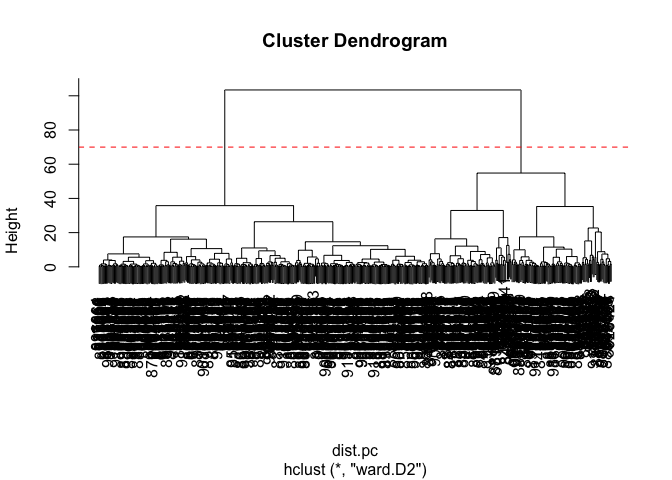

# Class 8 Mini-Project: Unsupervised Learning Analysis of Human Breast
Cancer Cells
Alisa Zhang (A18299618)

- [Background](#background)
- [Data Import](#data-import)
- [1. Exploratory Data Analysis](#1-exploratory-data-analysis)
- [2. Principal Component Analysis](#2-principal-component-analysis)
  - [Performing PCA](#performing-pca)
  - [Interpreting PCA results](#interpreting-pca-results)
  - [Variance explained](#variance-explained)
  - [Communicating PCA results](#communicating-pca-results)
- [3. Hierarchical clustering](#3-hierarchical-clustering)
  - [Results of hierarchical
    clustering](#results-of-hierarchical-clustering)
  - [Selecting number of clusters](#selecting-number-of-clusters)
  - [Using different methods](#using-different-methods)
- [4. K-means Clustering](#4-k-means-clustering)
- [5. Combining methods (PCA and
  Clustering)](#5-combining-methods-pca-and-clustering)
- [6. Sensitivity/Specificity](#6-sensitivityspecificity)
- [7. Prediction](#7-prediction)

## Background

The goal of this mini-project is for you to explore a complete analysis
using the unsupervised learning techniques covered in class. You’ll
extend what you’ve learned by combining PCA as a preprocessing step to
clustering using data that consist of measurements of cell nuclei of
human breast masses. This expands on our RNA-Seq analysis from last day.

The data itself comes from the Wisconsin Breast Cancer Diagnostic Data
Set first reported by K. P. Benne and O. L. Mangasarian: “Robust Linear
Programming Discrimination of Two Linearly Inseparable Sets”.

Values in this data set describe characteristics of the cell nuclei
present in digitized images of a fine needle aspiration (FNA) of a
breast mass.

## Data Import

Data was downloaded from the class website as a CSV file.

``` r
wisc.df <- read.csv("WisconsinCancer.csv", row.names=1)
head(wisc.df)
```

             diagnosis radius_mean texture_mean perimeter_mean area_mean
    842302           M       17.99        10.38         122.80    1001.0
    842517           M       20.57        17.77         132.90    1326.0
    84300903         M       19.69        21.25         130.00    1203.0
    84348301         M       11.42        20.38          77.58     386.1
    84358402         M       20.29        14.34         135.10    1297.0
    843786           M       12.45        15.70          82.57     477.1
             smoothness_mean compactness_mean concavity_mean concave.points_mean
    842302           0.11840          0.27760         0.3001             0.14710
    842517           0.08474          0.07864         0.0869             0.07017
    84300903         0.10960          0.15990         0.1974             0.12790
    84348301         0.14250          0.28390         0.2414             0.10520
    84358402         0.10030          0.13280         0.1980             0.10430
    843786           0.12780          0.17000         0.1578             0.08089
             symmetry_mean fractal_dimension_mean radius_se texture_se perimeter_se
    842302          0.2419                0.07871    1.0950     0.9053        8.589
    842517          0.1812                0.05667    0.5435     0.7339        3.398
    84300903        0.2069                0.05999    0.7456     0.7869        4.585
    84348301        0.2597                0.09744    0.4956     1.1560        3.445
    84358402        0.1809                0.05883    0.7572     0.7813        5.438
    843786          0.2087                0.07613    0.3345     0.8902        2.217
             area_se smoothness_se compactness_se concavity_se concave.points_se
    842302    153.40      0.006399        0.04904      0.05373           0.01587
    842517     74.08      0.005225        0.01308      0.01860           0.01340
    84300903   94.03      0.006150        0.04006      0.03832           0.02058
    84348301   27.23      0.009110        0.07458      0.05661           0.01867
    84358402   94.44      0.011490        0.02461      0.05688           0.01885
    843786     27.19      0.007510        0.03345      0.03672           0.01137
             symmetry_se fractal_dimension_se radius_worst texture_worst
    842302       0.03003             0.006193        25.38         17.33
    842517       0.01389             0.003532        24.99         23.41
    84300903     0.02250             0.004571        23.57         25.53
    84348301     0.05963             0.009208        14.91         26.50
    84358402     0.01756             0.005115        22.54         16.67
    843786       0.02165             0.005082        15.47         23.75
             perimeter_worst area_worst smoothness_worst compactness_worst
    842302            184.60     2019.0           0.1622            0.6656
    842517            158.80     1956.0           0.1238            0.1866
    84300903          152.50     1709.0           0.1444            0.4245
    84348301           98.87      567.7           0.2098            0.8663
    84358402          152.20     1575.0           0.1374            0.2050
    843786            103.40      741.6           0.1791            0.5249
             concavity_worst concave.points_worst symmetry_worst
    842302            0.7119               0.2654         0.4601
    842517            0.2416               0.1860         0.2750
    84300903          0.4504               0.2430         0.3613
    84348301          0.6869               0.2575         0.6638
    84358402          0.4000               0.1625         0.2364
    843786            0.5355               0.1741         0.3985
             fractal_dimension_worst
    842302                   0.11890
    842517                   0.08902
    84300903                 0.08758
    84348301                 0.17300
    84358402                 0.07678
    843786                   0.12440

The first column here `wisc.df$diagnosis` is a pathologist provided
expert diagnosis. We want to remove this from data for subsequent
analysis.

``` r
wisc.data <- wisc.df[,-1]
```

Finally, we will setup a separate new vector called diagnosis that
contains the data from the `diagnosis` column of the original dataset.

``` r
diagnosis <- factor(wisc.df$diagnosis)
```

## 1. Exploratory Data Analysis

> Q1. How many observations are in this dataset?

There are 569 observations/patients in the dataset.

> Q2. How many of the observations have a malignant diagnosis?

``` r
table(diagnosis)
```

    diagnosis
      B   M 
    357 212 

> Q3. How many variables/features in the data are suffixed with \_mean?

``` r
length(grep("_mean", colnames(wisc.data)))
```

    [1] 10

## 2. Principal Component Analysis

``` r
# Check column means
round(colMeans(wisc.data), 2)
```

                radius_mean            texture_mean          perimeter_mean 
                      14.13                   19.29                   91.97 
                  area_mean         smoothness_mean        compactness_mean 
                     654.89                    0.10                    0.10 
             concavity_mean     concave.points_mean           symmetry_mean 
                       0.09                    0.05                    0.18 
     fractal_dimension_mean               radius_se              texture_se 
                       0.06                    0.41                    1.22 
               perimeter_se                 area_se           smoothness_se 
                       2.87                   40.34                    0.01 
             compactness_se            concavity_se       concave.points_se 
                       0.03                    0.03                    0.01 
                symmetry_se    fractal_dimension_se            radius_worst 
                       0.02                    0.00                   16.27 
              texture_worst         perimeter_worst              area_worst 
                      25.68                  107.26                  880.58 
           smoothness_worst       compactness_worst         concavity_worst 
                       0.13                    0.25                    0.27 
       concave.points_worst          symmetry_worst fractal_dimension_worst 
                       0.11                    0.29                    0.08 

``` r
# Standard Deviations
round(apply(wisc.data,2,sd), 2)
```

                radius_mean            texture_mean          perimeter_mean 
                       3.52                    4.30                   24.30 
                  area_mean         smoothness_mean        compactness_mean 
                     351.91                    0.01                    0.05 
             concavity_mean     concave.points_mean           symmetry_mean 
                       0.08                    0.04                    0.03 
     fractal_dimension_mean               radius_se              texture_se 
                       0.01                    0.28                    0.55 
               perimeter_se                 area_se           smoothness_se 
                       2.02                   45.49                    0.00 
             compactness_se            concavity_se       concave.points_se 
                       0.02                    0.03                    0.01 
                symmetry_se    fractal_dimension_se            radius_worst 
                       0.01                    0.00                    4.83 
              texture_worst         perimeter_worst              area_worst 
                       6.15                   33.60                  569.36 
           smoothness_worst       compactness_worst         concavity_worst 
                       0.02                    0.16                    0.21 
       concave.points_worst          symmetry_worst fractal_dimension_worst 
                       0.07                    0.06                    0.02 

In general, we want to scale (with `prcomp(x, scale.=TRUE)`) our data
prior to PCA to ensure that **each feature contributes equally to the
analysis**, preventing variables with large variations (i.e. standard
dev) dominating.

### Performing PCA

Execute `prcomp()` function to do PCA.

``` r
wisc.pr <- prcomp(wisc.data, scale. = TRUE)
```

``` r
summary(wisc.pr)
```

    Importance of components:
                              PC1    PC2     PC3     PC4     PC5     PC6     PC7
    Standard deviation     3.6444 2.3857 1.67867 1.40735 1.28403 1.09880 0.82172
    Proportion of Variance 0.4427 0.1897 0.09393 0.06602 0.05496 0.04025 0.02251
    Cumulative Proportion  0.4427 0.6324 0.72636 0.79239 0.84734 0.88759 0.91010
                               PC8    PC9    PC10   PC11    PC12    PC13    PC14
    Standard deviation     0.69037 0.6457 0.59219 0.5421 0.51104 0.49128 0.39624
    Proportion of Variance 0.01589 0.0139 0.01169 0.0098 0.00871 0.00805 0.00523
    Cumulative Proportion  0.92598 0.9399 0.95157 0.9614 0.97007 0.97812 0.98335
                              PC15    PC16    PC17    PC18    PC19    PC20   PC21
    Standard deviation     0.30681 0.28260 0.24372 0.22939 0.22244 0.17652 0.1731
    Proportion of Variance 0.00314 0.00266 0.00198 0.00175 0.00165 0.00104 0.0010
    Cumulative Proportion  0.98649 0.98915 0.99113 0.99288 0.99453 0.99557 0.9966
                              PC22    PC23   PC24    PC25    PC26    PC27    PC28
    Standard deviation     0.16565 0.15602 0.1344 0.12442 0.09043 0.08307 0.03987
    Proportion of Variance 0.00091 0.00081 0.0006 0.00052 0.00027 0.00023 0.00005
    Cumulative Proportion  0.99749 0.99830 0.9989 0.99942 0.99969 0.99992 0.99997
                              PC29    PC30
    Standard deviation     0.02736 0.01153
    Proportion of Variance 0.00002 0.00000
    Cumulative Proportion  1.00000 1.00000

> Q4. From your results, what proportion of the original variance is
> captured by the first principal components (PC1)?

**44.27%** of the original variance is captured by PC1.

> Q5. How many principal components (PCs) are required to describe at
> least 70% of the original variance in the data?

We need at least **3** PCs to describe at least 70% of the variance.

> Q6. How many principal components (PCs) are required to describe at
> least 90% of the original variance in the data?

We need at least **7** PCs to describe at least 70% of the variance.

### Interpreting PCA results

The main PCA result figure is called a “score plot” or “PC plot” or
“ordination plot”…

``` r
library(ggplot2)
```

``` r
ggplot(wisc.pr$x) +
  aes(PC1, PC2, col=diagnosis) +
  geom_point()
```


Each point represents a sample and its measured cell characteristics in
the dataset.

**Biplot**

``` r
biplot(wisc.pr)
```


> Q7. What stands out to you about this plot? Is it easy or difficult to
> understand? Why?

This is very difficult to understand because everything is clustered
together, making it hard to read and interpret.

**Back to scatterplot**

> Q8. Generate a similar scatterplot for principal components 1 and 3.
> What do you notice about these plots?

``` r
# Repeat for components 1 and 3
ggplot(wisc.pr$x) +
  aes(PC1, PC3, col=diagnosis) +
  geom_point()
```


Even though PC2 captures more variance than PC3, the above graph still
does a pretty good job in separating malignant and benign sample.

### Variance explained

In this section, we will produce scree plots showing the proportion of
variance explained as the number of principal components increases.

Squaring the standard deviation will give us the variance of each PC.

``` r
pr.var <- wisc.pr$sdev^2
head(pr.var)
```

    [1] 13.281608  5.691355  2.817949  1.980640  1.648731  1.207357

Calculate the variance explained by each principal component by dividing
by the total variance explained of all principal components. Create a
plot of variance.

``` r
# Variance explained by each principal component: pve
pve <- pr.var / sum(pr.var)

# Plot variance explained for each principal component
plot(pve, xlab = "Principal Component", 
     ylab = "Proportion of Variance Explained", 
     ylim = c(0, 1), type = "o")
```


*If there’s an ‘elbow’ in the amount of variance explained that might
lead you to pick a natural number of principal components.*

``` r
# Alternative scree plot of the same data, note data driven y-axis
barplot(pve, ylab = "Precent of Variance Explained",
     names.arg=paste0("PC",1:length(pve)), las=2, axes = FALSE)
axis(2, at=pve, labels=round(pve,2)*100 )
```


CRAN packages that are helpful for PCA.

``` r
## ggplot based graph
library(factoextra)
```

    Welcome! Want to learn more? See two factoextra-related books at https://goo.gl/ve3WBa

``` r
fviz_eig(wisc.pr, addlabels = TRUE)
```

    Warning in geom_bar(stat = "identity", fill = barfill, color = barcolor, :
    Ignoring empty aesthetic: `width`.


### Communicating PCA results

> Q9. For the first principal component, what is the component of the
> loading vector (i.e. wisc.pr\$rotation\[,1\]) for the feature
> concave.points_mean?

``` r
wisc.pr$rotation[,1]["concave.points_mean"]
```

    concave.points_mean 
             -0.2608538 

``` r
# OR wisc.pr$rotation["concave.points_mean","PC1"]
```

> Q10. What is the minimum number of principal components required to
> explain 80% of the variance of the data?

From our previous `summary(wisc.pr)` result, we need at least **5** PCs.

## 3. Hierarchical clustering

``` r
# Scale the wisc.data data using the "scale()" function
data.scaled <- scale(wisc.data)
```

Calculate the **(Euclidean) distances** between all pairs of
observations in the new scaled dataset

``` r
data.dist <- dist(data.scaled)
```

Create a hierarchical clustering model using complete linkage.

``` r
wisc.hclust <- hclust(data.dist, method = "complete")
```

### Results of hierarchical clustering

View the clustering dendrogram result.

> Q11. Using the plot() and abline() functions, what is the height at
> which the clustering model has 4 clusters?

Height should be **19**.

``` r
plot(wisc.hclust)
abline(h=19, col="red", lty=2)
```


### Selecting number of clusters

``` r
wisc.hclust.clusters <- cutree(wisc.hclust, k=4)
table(wisc.hclust.clusters)
```

    wisc.hclust.clusters
      1   2   3   4 
    177   7 383   2 

``` r
table(wisc.hclust.clusters, diagnosis)
```

                        diagnosis
    wisc.hclust.clusters   B   M
                       1  12 165
                       2   2   5
                       3 343  40
                       4   0   2

> Q12. Can you find a better cluster vs diagnoses match by cutting into
> a different number of clusters between 2 and 10?

``` r
table(cutree(wisc.hclust, k=2), diagnosis)
```

       diagnosis
          B   M
      1 357 210
      2   0   2

``` r
table(cutree(wisc.hclust, k=10), diagnosis)
```

        diagnosis
           B   M
      1   12  86
      2    0  59
      3    0   3
      4  331  39
      5    0  20
      6    2   0
      7   12   0
      8    0   2
      9    0   2
      10   0   1

Either ends, the clustering is not very helpful, as most of the data
fall into one group only.

### Using different methods

> Q13. Which method gives your favorite results for the same data.dist
> dataset? Explain your reasoning.

See plots below. `ward.D2` method seems to be the best, because in
comparison to the rest, it at least clearly clustered the dataset into 2
main branches.

`single` method:

``` r
plot(hclust(data.dist, method = "single"))
```


`complete` method:

``` r
plot(hclust(data.dist, method = "complete"))
```


`average` method:

``` r
plot(hclust(data.dist, method = "average"))
```


`ward.D2` method:

``` r
plot(hclust(data.dist, method = "ward.D2"))
```


## 4. K-means Clustering

``` r
wisc.km <- kmeans(scale(wisc.data), centers= 2, nstart= 20)
```

``` r
table(wisc.km$cluster, diagnosis)
```

       diagnosis
          B   M
      1  14 175
      2 343  37

## 5. Combining methods (PCA and Clustering)

Clustering the original data was not very productive. The PCA results
looked promising. Here we combine these methods by clustering from our
PCA results. In other words, “clustering in PC space”.

``` r
# Take the first 3 PC
dist.pc <- dist(wisc.pr$x[,1:3])
```

``` r
wisc.pr.hclust <- hclust(dist.pc, method = "ward.D2")
```

View the tree…

``` r
plot(wisc.pr.hclust)
abline(h=70, col="red", lty=2)
```



To get our clustering membership vector (i.e. our main clustering
result), we “cut” the tree at a desired height or to yield a desired
number of “k” groups.

``` r
grps <- cutree(wisc.pr.hclust, k=2)
table(grps)
```

    grps
      1   2 
    203 366 

How does this clustering groups compare to the expert diagnosis?

``` r
table(grps, diagnosis)
```

        diagnosis
    grps   B   M
       1  24 179
       2 333  33

``` r
plot(wisc.pr$x[,1:2], col=grps)
```


``` r
plot(wisc.pr$x[,1:2], col=diagnosis)
```


*Changing colors for consistency:*

``` r
g <- as.factor(grps)
levels(g)
```

    [1] "1" "2"

``` r
g <- relevel(g,2)
levels(g)
```

    [1] "2" "1"

``` r
# Plot using our re-ordered factor 
plot(wisc.pr$x[,1:2], col=g)
```


We can be fancy and look in 3D with the rgl or plotly packages.

``` r
library(rgl)
plot3d(wisc.pr$x[,1:3], xlab="PC 1", ylab="PC 2", zlab="PC 3", cex=1.5, size=1, type="s", col=grps)
```

``` r
# Take the first 7 PC
dist.pc <- dist(wisc.pr$x[,1:7])
```

``` r
## Use the distance along the first 7 PCs for clustering i.e. wisc.pr$x[, 1:7]
wisc.pr.hclust <- hclust(dist.pc, method="ward.D2")
```

``` r
# cut into 2 clusters (?)
wisc.pr.hclust.clusters <- cutree(wisc.pr.hclust, k=2)
```

> Q15. How well does the newly created model with four clusters separate
> out the two diagnoses?

\*\*Previous paragraph asked us to create two clusters. Not sure if this
is a typo in the question. If the question is referring to four clusters
still, the results are oversplitted to cluster 4.

If the question is asking about the 2 clustered splitted from 7 PCs:

``` r
table(wisc.pr.hclust.clusters, diagnosis)
```

                           diagnosis
    wisc.pr.hclust.clusters   B   M
                          1  28 188
                          2 329  24

Members in each clusters in different diagnosis is splitted out in exact
same ratio as when we were just using 3 PCs.

> Q16. How well do the k-means and hierarchical clustering models you
> created in previous sections (i.e. before PCA) do in terms of
> separating the diagnoses? Again, use the table() function to compare
> the output of each model (wisc.km\$cluster and wisc.hclust.clusters)
> with the vector containing the actual diagnoses.

``` r
table(wisc.km$cluster, diagnosis)
```

       diagnosis
          B   M
      1  14 175
      2 343  37

``` r
table(wisc.hclust.clusters, diagnosis)
```

                        diagnosis
    wisc.hclust.clusters   B   M
                       1  12 165
                       2   2   5
                       3 343  40
                       4   0   2

K-means splited the data slightly better, as most of the data in
hierarchical clustering are in cluster group 1 and 3.

## 6. Sensitivity/Specificity

Sensitivity = TP/(TP+FN)

Specificity = TN/(TN+FN)

> Q17. Which of your analysis procedures resulted in a clustering model
> with the best specificity? How about sensitivity?

*K-means:*

- TP = 175

- FP = 14

- TN = 343

- FN = 37

Sensitivity = 175 / (175 + 37) = 0.8254717

Specificity = 343 / (343 + 14) = 0.9607843

*hclust before PCA:*

- TP = 165

- FP = 12

- TN = 343

- FN = 40

Sensitivity = 0.804878

Specificity = 0.9661972

*hclust with PCA:*

- TP = 188

- FP = 28

- TN = 329

- FN = 24

Sensitivity = 0.8867925

Specificity = 0.9215686

**hclust with PCA** has the highest Sensitivity, while **hclust before
PCA** has the highest Specificity (kmeans is pretty close).

## 7. Prediction

We can use our PCA model for prediction with new input patient samples.

``` r
url <- "https://tinyurl.com/new-samples-CSV"
new <- read.csv(url)
npc <- predict(wisc.pr, newdata=new)
npc
```

               PC1       PC2        PC3        PC4       PC5        PC6        PC7
    [1,]  2.576616 -3.135913  1.3990492 -0.7631950  2.781648 -0.8150185 -0.3959098
    [2,] -4.754928 -3.009033 -0.1660946 -0.6052952 -1.140698 -1.2189945  0.8193031
                PC8       PC9       PC10      PC11      PC12      PC13     PC14
    [1,] -0.2307350 0.1029569 -0.9272861 0.3411457  0.375921 0.1610764 1.187882
    [2,] -0.3307423 0.5281896 -0.4855301 0.7173233 -1.185917 0.5893856 0.303029
              PC15       PC16        PC17        PC18        PC19       PC20
    [1,] 0.3216974 -0.1743616 -0.07875393 -0.11207028 -0.08802955 -0.2495216
    [2,] 0.1299153  0.1448061 -0.40509706  0.06565549  0.25591230 -0.4289500
               PC21       PC22       PC23       PC24        PC25         PC26
    [1,]  0.1228233 0.09358453 0.08347651  0.1223396  0.02124121  0.078884581
    [2,] -0.1224776 0.01732146 0.06316631 -0.2338618 -0.20755948 -0.009833238
                 PC27        PC28         PC29         PC30
    [1,]  0.220199544 -0.02946023 -0.015620933  0.005269029
    [2,] -0.001134152  0.09638361  0.002795349 -0.019015820

``` r
plot(wisc.pr$x[,1:2], col=g)
points(npc[,1], npc[,2], col="blue", pch=16, cex=3)
text(npc[,1], npc[,2], c(1,2), col="white")
```


> Q18. Which of these new patients should we prioritize for follow up
> based on your results?

Since color red signals malignant, **patient 2** should be prioritized.
