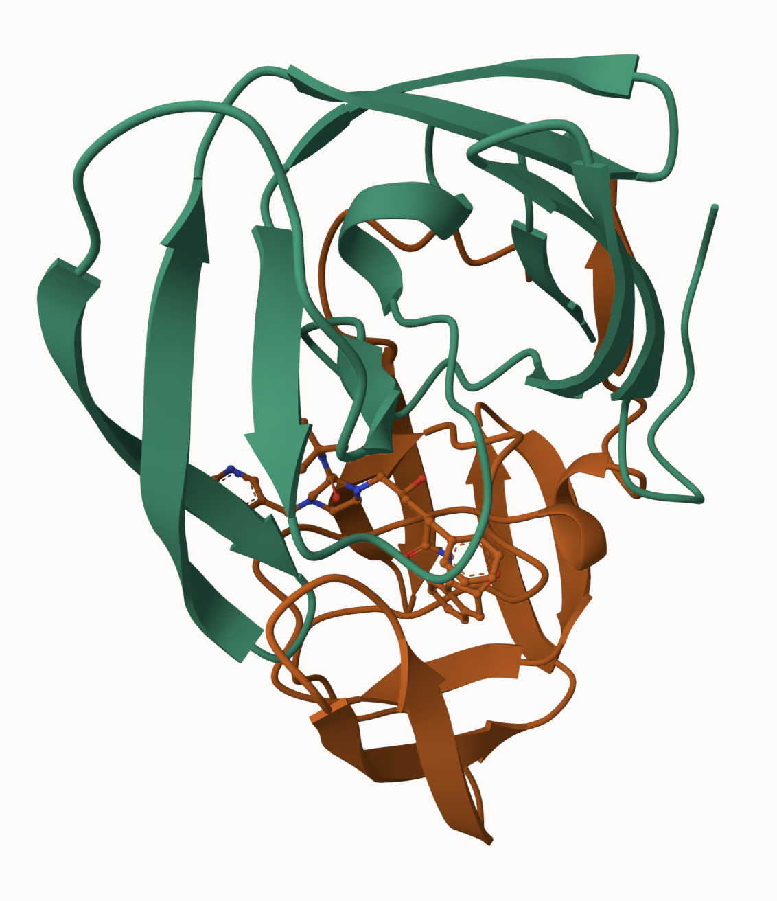
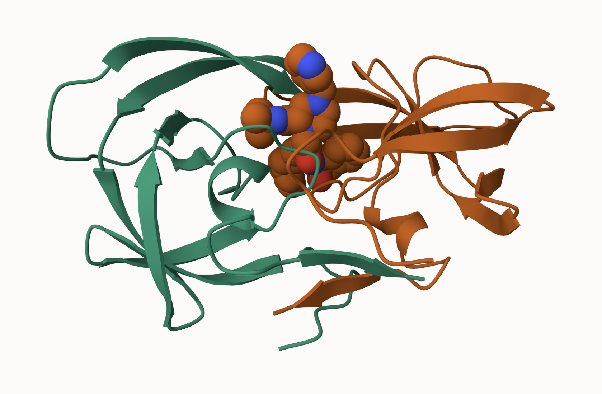

# Class 09: Structural Bioinformatics (pt1)
Alisa Zhang (PID: A18299618)

- [PDB statistics](#pdb-statistics)
- [Exploring PDB Statistics](#exploring-pdb-statistics)
- [PDB objects in R](#pdb-objects-in-r)
- [Predicting Protein Flexibility](#predicting-protein-flexibility)

## PDB statistics

The main database for structural biology is called the PDB. Let’s have a
look at what it contains:

> Q1. What percentage of structures in the PDB are solved by X-Ray and
> Electron Microscopy.

``` r
data <- read.csv("Data Export Summary.csv")
head(data)
```

               Molecular.Type   X.ray     EM    NMR Integrative Multiple.methods
    1          Protein (only) 176,378 20,438 12,709         342              221
    2 Protein/Oligosaccharide  10,284  3,396     34           8               11
    3              Protein/NA   9,007  5,931    287          24                7
    4     Nucleic acid (only)   3,077    200  1,554           2               15
    5                   Other     174     13     33           3                0
    6  Oligosaccharide (only)      11      0      6           0                1
      Neutron Other   Total
    1      83    32 210,203
    2       1     0  13,734
    3       0     0  15,256
    4       3     1   4,852
    5       0     0     223
    6       0     4      22

``` r
data$Total
```

    [1] "210,203" "13,734"  "15,256"  "4,852"   "223"     "22"     

``` r
data$Neutron
```

    [1] 83  1  0  3  0  0

Some data are not numeric.

``` r
library(tidyverse)
```

    ── Attaching core tidyverse packages ──────────────────────── tidyverse 2.0.0 ──
    ✔ dplyr     1.1.4     ✔ readr     2.1.5
    ✔ forcats   1.0.1     ✔ stringr   1.6.0
    ✔ ggplot2   4.0.0     ✔ tibble    3.3.0
    ✔ lubridate 1.9.4     ✔ tidyr     1.3.1
    ✔ purrr     1.2.0     
    ── Conflicts ────────────────────────────────────────── tidyverse_conflicts() ──
    ✖ dplyr::filter() masks stats::filter()
    ✖ dplyr::lag()    masks stats::lag()
    ℹ Use the conflicted package (<http://conflicted.r-lib.org/>) to force all conflicts to become errors

``` r
pdb <- read_csv("Data Export Summary.csv")
```

    Rows: 6 Columns: 9
    ── Column specification ────────────────────────────────────────────────────────
    Delimiter: ","
    chr (1): Molecular Type
    dbl (4): Integrative, Multiple methods, Neutron, Other
    num (4): X-ray, EM, NMR, Total

    ℹ Use `spec()` to retrieve the full column specification for this data.
    ℹ Specify the column types or set `show_col_types = FALSE` to quiet this message.

``` r
pdb
```

    # A tibble: 6 × 9
      `Molecular Type`    `X-ray`    EM   NMR Integrative `Multiple methods` Neutron
      <chr>                 <dbl> <dbl> <dbl>       <dbl>              <dbl>   <dbl>
    1 Protein (only)       176378 20438 12709         342                221      83
    2 Protein/Oligosacch…   10284  3396    34           8                 11       1
    3 Protein/NA             9007  5931   287          24                  7       0
    4 Nucleic acid (only)    3077   200  1554           2                 15       3
    5 Other                   174    13    33           3                  0       0
    6 Oligosaccharide (o…      11     0     6           0                  1       0
    # ℹ 2 more variables: Other <dbl>, Total <dbl>

``` r
pro.xray <- sum(pdb$`X-ray`)/sum(pdb$Total)*100
pro.em <- sum(pdb$EM)/sum(pdb$Total)*100
```

``` r
round(pro.xray,2)
```

    [1] 81.43

``` r
round(pro.em,2)
```

    [1] 12.27

81.48% are solved by X-Ray, and 12.22% are solved by Electron
Microscopy.

> Q2. What proportion of structures in the PDB are protein?

``` r
pro.protein <- sum(pdb[1:3,"Total"])/sum(pdb$Total) * 100
round(pro.protein,2)
```

    [1] 97.91

97.91% are protein.

## Exploring PDB Statistics

> Q3. Type HIV in the PDB website search box on the home page and
> determine how many HIV-1 protease structures are in the current PDB?

4,866 structures are in PDB.

Package for structural bioinformatics…

``` r
library(bio3d)

hiv <- read.pdb("1hsg")
```

      Note: Accessing on-line PDB file

``` r
hiv
```


     Call:  read.pdb(file = "1hsg")

       Total Models#: 1
         Total Atoms#: 1686,  XYZs#: 5058  Chains#: 2  (values: A B)

         Protein Atoms#: 1514  (residues/Calpha atoms#: 198)
         Nucleic acid Atoms#: 0  (residues/phosphate atoms#: 0)

         Non-protein/nucleic Atoms#: 172  (residues: 128)
         Non-protein/nucleic resid values: [ HOH (127), MK1 (1) ]

       Protein sequence:
          PQITLWQRPLVTIKIGGQLKEALLDTGADDTVLEEMSLPGRWKPKMIGGIGGFIKVRQYD
          QILIEICGHKAIGTVLVGPTPVNIIGRNLLTQIGCTLNFPQITLWQRPLVTIKIGGQLKE
          ALLDTGADDTVLEEMSLPGRWKPKMIGGIGGFIKVRQYDQILIEICGHKAIGTVLVGPTP
          VNIIGRNLLTQIGCTLNF

    + attr: atom, xyz, seqres, helix, sheet,
            calpha, remark, call

Let’s first use the Mol\* viewer to explore this structure.





## PDB objects in R

``` r
head(hiv$atom)
```

      type eleno elety  alt resid chain resno insert      x      y     z o     b
    1 ATOM     1     N <NA>   PRO     A     1   <NA> 29.361 39.686 5.862 1 38.10
    2 ATOM     2    CA <NA>   PRO     A     1   <NA> 30.307 38.663 5.319 1 40.62
    3 ATOM     3     C <NA>   PRO     A     1   <NA> 29.760 38.071 4.022 1 42.64
    4 ATOM     4     O <NA>   PRO     A     1   <NA> 28.600 38.302 3.676 1 43.40
    5 ATOM     5    CB <NA>   PRO     A     1   <NA> 30.508 37.541 6.342 1 37.87
    6 ATOM     6    CG <NA>   PRO     A     1   <NA> 29.296 37.591 7.162 1 38.40
      segid elesy charge
    1  <NA>     N   <NA>
    2  <NA>     C   <NA>
    3  <NA>     C   <NA>
    4  <NA>     O   <NA>
    5  <NA>     C   <NA>
    6  <NA>     C   <NA>

Extract the sequence..

``` r
pdbseq(hiv)
```

      1   2   3   4   5   6   7   8   9  10  11  12  13  14  15  16  17  18  19  20 
    "P" "Q" "I" "T" "L" "W" "Q" "R" "P" "L" "V" "T" "I" "K" "I" "G" "G" "Q" "L" "K" 
     21  22  23  24  25  26  27  28  29  30  31  32  33  34  35  36  37  38  39  40 
    "E" "A" "L" "L" "D" "T" "G" "A" "D" "D" "T" "V" "L" "E" "E" "M" "S" "L" "P" "G" 
     41  42  43  44  45  46  47  48  49  50  51  52  53  54  55  56  57  58  59  60 
    "R" "W" "K" "P" "K" "M" "I" "G" "G" "I" "G" "G" "F" "I" "K" "V" "R" "Q" "Y" "D" 
     61  62  63  64  65  66  67  68  69  70  71  72  73  74  75  76  77  78  79  80 
    "Q" "I" "L" "I" "E" "I" "C" "G" "H" "K" "A" "I" "G" "T" "V" "L" "V" "G" "P" "T" 
     81  82  83  84  85  86  87  88  89  90  91  92  93  94  95  96  97  98  99   1 
    "P" "V" "N" "I" "I" "G" "R" "N" "L" "L" "T" "Q" "I" "G" "C" "T" "L" "N" "F" "P" 
      2   3   4   5   6   7   8   9  10  11  12  13  14  15  16  17  18  19  20  21 
    "Q" "I" "T" "L" "W" "Q" "R" "P" "L" "V" "T" "I" "K" "I" "G" "G" "Q" "L" "K" "E" 
     22  23  24  25  26  27  28  29  30  31  32  33  34  35  36  37  38  39  40  41 
    "A" "L" "L" "D" "T" "G" "A" "D" "D" "T" "V" "L" "E" "E" "M" "S" "L" "P" "G" "R" 
     42  43  44  45  46  47  48  49  50  51  52  53  54  55  56  57  58  59  60  61 
    "W" "K" "P" "K" "M" "I" "G" "G" "I" "G" "G" "F" "I" "K" "V" "R" "Q" "Y" "D" "Q" 
     62  63  64  65  66  67  68  69  70  71  72  73  74  75  76  77  78  79  80  81 
    "I" "L" "I" "E" "I" "C" "G" "H" "K" "A" "I" "G" "T" "V" "L" "V" "G" "P" "T" "P" 
     82  83  84  85  86  87  88  89  90  91  92  93  94  95  96  97  98  99 
    "V" "N" "I" "I" "G" "R" "N" "L" "L" "T" "Q" "I" "G" "C" "T" "L" "N" "F" 

``` r
chainA_seq <- pdbseq(trim.pdb(hiv, chain="A"))
```

I can interactively view these PDB objects with the **bio3dviewer**
package.

``` r
# install.packages("pak")
# pak::pak("bioboot/bio3dview")
# install.packages("NGLVieweR")
```

``` r
library(bio3dview)
# view.pdb(hiv)
```

``` r
# sel <- atom.select(hiv,resno=25)

# view.pdb(hiv, highlight = sel,
#         highlight.style = "spacefill",
#         colorScheme = "chain",
#         col=c("blue","red"),
#         backgroundColor = "grey")
```

## Predicting Protein Flexibility

We can also run a bioinformatics calculation to predict protein dynamics
(i.e. functional motions).

We will use the nma() function.

``` r
adk <- read.pdb("6s36")
```

      Note: Accessing on-line PDB file
       PDB has ALT records, taking A only, rm.alt=TRUE

``` r
m <- nma(adk)
```

     Building Hessian...        Done in 0.018 seconds.
     Diagonalizing Hessian...   Done in 0.384 seconds.

``` r
plot(m)
```


Generate a “trajectory” of predicted motion.

``` r
mktrj(m, file="ADK_nma.pdb")
```
