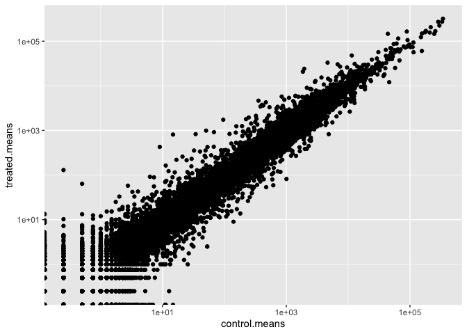

# Class 12: Transcriptomics and the analysis of RNA-Seq data
Alisa Zhang (PID: A18299618)

- [Background](#background)
- [Data Import](#data-import)
- [Toy differential gene expression](#toy-differential-gene-expression)
- [DESeq2 analysis](#deseq2-analysis)
- [Volcano Plot](#volcano-plot)
- [Save our results](#save-our-results)

## Background

Today we will analyze some RNASeq data from Himes et al. on the effects
of a common steroid (dexamethasone) on airway smooth muscle cells (ASM
cells).

Our starting point is the “counts” data and “metadata” that contains the
count values for each gene in their different experiment (i.e. cell
lines with or without the drug).

## Data Import

``` r
counts <- read.csv("airway_scaledcounts.csv", row.names=1)
metadata <-  read.csv("airway_metadata.csv")
```

Let’s have a peak at these objects

``` r
head(counts)
```

                    SRR1039508 SRR1039509 SRR1039512 SRR1039513 SRR1039516
    ENSG00000000003        723        486        904        445       1170
    ENSG00000000005          0          0          0          0          0
    ENSG00000000419        467        523        616        371        582
    ENSG00000000457        347        258        364        237        318
    ENSG00000000460         96         81         73         66        118
    ENSG00000000938          0          0          1          0          2
                    SRR1039517 SRR1039520 SRR1039521
    ENSG00000000003       1097        806        604
    ENSG00000000005          0          0          0
    ENSG00000000419        781        417        509
    ENSG00000000457        447        330        324
    ENSG00000000460         94        102         74
    ENSG00000000938          0          0          0

``` r
head(metadata)
```

              id     dex celltype     geo_id
    1 SRR1039508 control   N61311 GSM1275862
    2 SRR1039509 treated   N61311 GSM1275863
    3 SRR1039512 control  N052611 GSM1275866
    4 SRR1039513 treated  N052611 GSM1275867
    5 SRR1039516 control  N080611 GSM1275870
    6 SRR1039517 treated  N080611 GSM1275871

> Q1. How many genes are in this dataset?

``` r
nrow(counts)
```

    [1] 38694

``` r
nrow(metadata)
```

    [1] 8

> Q. How many different experiments (col in counts or rows in metadata)
> are there?

``` r
ncol(counts)
```

    [1] 8

> Q2. How many ‘control’ cell lines do we have?

``` r
sum(metadata$dex == "control")
```

    [1] 4

## Toy differential gene expression

To start our analysis let’s calculate the mean counts for all genes in
the “control” experiments.

1.  Extract all “control” columns from the `counts` objects
2.  Calculate the mean 3-4. Do the same for “treated”
3.  Compare these `control.mean`

``` r
control.inds <- metadata$dex == "control"
control.counts <- counts[ , control.inds]
```

``` r
control.means <- rowMeans(control.counts)
```

``` r
treated.inds <- metadata$dex == "treated"
treated.counts <- counts[ , treated.inds]
```

``` r
treated.means <- rowMeans(treated.counts)
```

Store these together for ease of bookkeeping as `meancounts`

``` r
meancounts <- data.frame(control.means, treated.means)
head(meancounts)
```

                    control.means treated.means
    ENSG00000000003        900.75        658.00
    ENSG00000000005          0.00          0.00
    ENSG00000000419        520.50        546.00
    ENSG00000000457        339.75        316.50
    ENSG00000000460         97.25         78.75
    ENSG00000000938          0.75          0.00

``` r
library(ggplot2)
ggplot(meancounts) +
  aes(control.means, treated.means) +
  geom_point()
```


\*if all points lie on the diagonal line, that means theres no
difference between control and treated. Since the data is very skewed,
we should start with a log transform.

``` r
ggplot(meancounts) +
  aes(control.means, treated.means) +
  geom_point() +
  scale_x_log10() +
  scale_y_log10()
```

    Warning in scale_x_log10(): log-10 transformation introduced infinite values.

    Warning in scale_y_log10(): log-10 transformation introduced infinite values.



We often talk about metrics like “log2 fold-change”

``` r
# treated/control

# log2() is easy for us to understand
# log2(10/10) = 0
# log2(10/20) = -1
# log2(10/40) = -2
# log2(40/10) = 2
```

Let’s calculate the log2 fold change for our treated over control mean
counts.

``` r
meancounts["log2fc"] <- log2(meancounts$treated.means / meancounts$control.means)
```

``` r
head(meancounts)
```

                    control.means treated.means      log2fc
    ENSG00000000003        900.75        658.00 -0.45303916
    ENSG00000000005          0.00          0.00         NaN
    ENSG00000000419        520.50        546.00  0.06900279
    ENSG00000000457        339.75        316.50 -0.10226805
    ENSG00000000460         97.25         78.75 -0.30441833
    ENSG00000000938          0.75          0.00        -Inf

A common “rule of thumb” is a log2 fold change cutoff of +2 and -2 to
call genes “up regulated” or “down regulated”.

Number of “up” genes:

``` r
sum(meancounts$log2fc >= +2, na.rm=T)
```

    [1] 1910

Number of “down” genes at -2 threshold:

``` r
sum(meancounts$log2fc <= -2, na.rm=T)
```

    [1] 2330

## DESeq2 analysis

Lets do this analysis properly – are the differences we see between drug
and no drug significant given the replicate experiments.

``` r
library(DESeq2)
```

For DESeq analysis, we need three things:

1.  count values (`countData`)
2.  metadata telling us about the columns in `countData` (`colData`)
3.  design of the experiment (i.e. what do you want to compare)

Our first function from DESeq2 will setup the input required for
analysis by storing all these 3 things together.

``` r
dds <- DESeqDataSetFromMatrix(countData = counts,
                              colData = metadata,
                              design = ~dex)
```

    converting counts to integer mode

    Warning in DESeqDataSet(se, design = design, ignoreRank): some variables in
    design formula are characters, converting to factors

The main function in DESeq2 that runs analysis is called `DESeq`

``` r
dds <- DESeq(dds)
```

    estimating size factors

    estimating dispersions

    gene-wise dispersion estimates

    mean-dispersion relationship

    final dispersion estimates

    fitting model and testing

``` r
res <- results(dds)
head(res)
```

    log2 fold change (MLE): dex treated vs control 
    Wald test p-value: dex treated vs control 
    DataFrame with 6 rows and 6 columns
                      baseMean log2FoldChange     lfcSE      stat    pvalue
                     <numeric>      <numeric> <numeric> <numeric> <numeric>
    ENSG00000000003 747.194195      -0.350703  0.168242 -2.084514 0.0371134
    ENSG00000000005   0.000000             NA        NA        NA        NA
    ENSG00000000419 520.134160       0.206107  0.101042  2.039828 0.0413675
    ENSG00000000457 322.664844       0.024527  0.145134  0.168996 0.8658000
    ENSG00000000460  87.682625      -0.147143  0.256995 -0.572550 0.5669497
    ENSG00000000938   0.319167      -1.732289  3.493601 -0.495846 0.6200029
                         padj
                    <numeric>
    ENSG00000000003  0.163017
    ENSG00000000005        NA
    ENSG00000000419  0.175937
    ENSG00000000457  0.961682
    ENSG00000000460  0.815805
    ENSG00000000938        NA

## Volcano Plot

This is a common summary result figure from these types of experiments
and plot the log2 fold-change vs. the adjusted p-value.

``` r
plot(res$log2FoldChange, -log(res$padj))
abline(v=c(-2,2), col="red") # ones that expression of genes w or w/o drug changes a lot (away from 0)
abline(h=-log(0.04), col="red") # ones that are statistically significant (above the line)
```


## Save our results

``` r
write.csv(res, file="my_results.csv")
```
