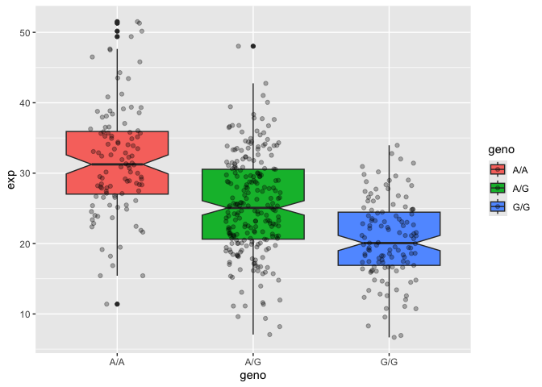

# Class 17: Introduction to Genome Informatics Lab
Alisa Zhang (PID: A18299618)

## Section 1: Proportion of G/G in MXL Population

Downloaded csv file from Ensembl

``` r
mxl <- read.csv("373531-SampleGenotypes-Homo_sapiens_Variation_Sample_rs8067378.csv")
```

``` r
round( table(mxl$Genotype..forward.strand.) / nrow(mxl) * 100, 2)
```


      A|A   A|G   G|A   G|G 
    34.38 32.81 18.75 14.06 

## Now for another population…

``` r
gbr <- read.csv("373522-SampleGenotypes-Homo_sapiens_Variation_Sample_rs8067378.csv")
```

``` r
round (table(gbr$Genotype..forward.strand.) / nrow(mxl) * 100, 2)
```


      A|A   A|G   G|A   G|G 
    35.94 26.56 37.50 42.19 

This variant that is associated with childhood asthma is more frequent
in the GBR population than the MKL population.

## Section 4: Population Scale Analysis

One sample is obviously not enough to know what is happening in a
population. You are interested in assessing genetic differences on a
population scale.

So, you processed about ~230 samples and did the normalization on a
genome level. Now, you want to find whether there is any association of
the 4 asthma-associated SNPs (rs8067378…) on ORMDL3 expression.

``` r
expr <- read.table("rs8067378_ENSG00000172057.6.txt")

head(expr)
```

       sample geno      exp
    1 HG00367  A/G 28.96038
    2 NA20768  A/G 20.24449
    3 HG00361  A/A 31.32628
    4 HG00135  A/A 34.11169
    5 NA18870  G/G 18.25141
    6 NA11993  A/A 32.89721

``` r
nrow(expr)
```

    [1] 462

``` r
table(expr$geno)
```


    A/A A/G G/G 
    108 233 121 

``` r
summary(expr)
```

        sample              geno                exp        
     Length:462         Length:462         Min.   : 6.675  
     Class :character   Class :character   1st Qu.:20.004  
     Mode  :character   Mode  :character   Median :25.116  
                                           Mean   :25.640  
                                           3rd Qu.:30.779  
                                           Max.   :51.518  

``` r
library(ggplot2)
```

``` r
ggplot(expr) +
  aes(geno, exp, fill=geno) +
  geom_boxplot(notch = T) +
  geom_jitter(position = position_jitter(width = 0.2), alpha = 0.3)
```


